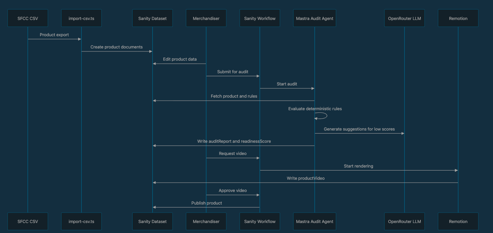
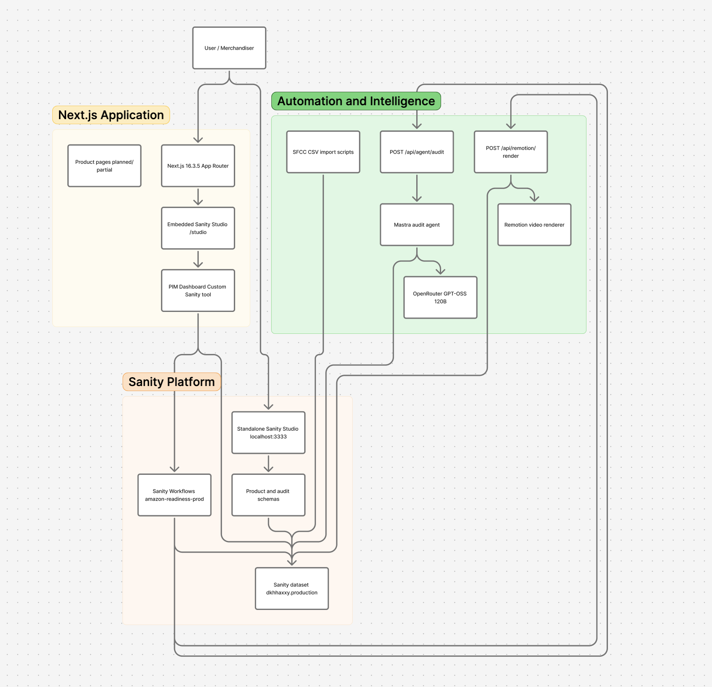

## What I Built
<!-- Tell us about the app you prompted into existence. What does it do and who is it for? -->

### PIM-Lite

PIM  - Product Infromation Management, but in our case PIM = Product Intellegince Manangement, getting intelligence into creating products and assisting small-medium retailers with gettin their proudctus to a larger marketplace like Amazon. 

What started as a small  product information manager for pushing a Salesforce Commerce Cloud catalogue
to Amazon, built on Sanity, then morphed into why can not Sanity itself become the Source of truth for Products. And we then got around 10K products imported into Sanity. Currently we have around 4500 sample products stored.  We have right now chosen only one channel, that is Amazon as they are the largest marketplace. 

An AI agent audits each product against Amazon channel rules **that live in
Sanity as content**, a Sanity Workflow moves the product through review, and an
approved product renders its own promo video. Fixing a product's issues
re-audits it, which advances the workflow, which re-renders the video.

Built for the dev.to Sanity Challenge, Path Two — *Vibe-Code Something Strange*.



### What is actually interesting here

***Audit rules are content, not code.*** `auditRule` is a document type. The
scoring engine fetches enabled rules at run time:

A merchandiser can add a check, retune a severity, or disable a rule from the
Studio, and the next audit picks it up — no deploy, no code change. Rules that
genuinely need cross-field logic (apparel needs a material type; a price over
$10,000 outside a luxury category is suspicious) stay in code as a deliberate,
documented escape hatch.

**The workflow calls out to an agent.** Entering the `audit-pending` stage
queues an effect. Our own handler drains it, runs a Mastra agent against Gemini,
and writes the report back as a document. The stage does not advance on a timer
or a callback — it advances because the agent wrote `readinessScore` onto the
product, which is what the stage's completion condition observes.

**Nothing pushes those effects to us.** `selfHosted` means the engine owns
dispatch: a queued effect sits on the instance until something holding an engine
calls `drainEffects`, which claims it and runs the handler registered under its
name. Two things do that — the Studio dashboard pumps the instance on screen,
and `pnpm workflow:drain` sweeps every instance headlessly. There is no webhook
and no endpoint of ours registered with Sanity.

**A person and an agent advance the pipeline the same way.** There is no
"workflow stage" field on the product. The workflow instance is the only record
of where a product is, and every control in the dashboard fires an action on
that instance rather than patching a document to fake a move.

**Approval renders a video.** Clearing review triggers a Remotion render whose
copy comes from the audited product. The finished video writes a reference back
onto the product, which is what advances the workflow again.

## Demo
Inculde a video

## Code


## The pipeline

```
draft → audit-pending → audit-passed → video-requested → video-ready → published
  │           │
  │           └── human-review     (score 45–49: a person decides)
  │
  └── on entry: enrich-product fills gtin, brand, condition, image
```

Entering `draft` queues enrichment, because a product's score is otherwise
capped by factual fields no copy suggestion can supply — a product with perfect
marketing copy and no GTIN still cannot pass.

Transitions out of `audit-pending` are gated on the readiness score: 50 or above
passes, 45–49 stops for human review, below 45 returns to draft. Those
thresholds live in `sanity.workflow.ts` and nowhere else — the dashboard's
buttons are bound to whatever the engine reports as currently allowed, so the
interface cannot disagree with the engine.

## Architecture

| Piece | What it does |
| --- | --- |
| `sanity.workflow.ts` | The one workflow definition. Must be at the repo root — the Workflows CLI resolves its config by filename against the root only. |
| `components/pim-dashboard/effectHandlers.ts` | Handlers the engine dispatches queued effects to, keyed by effect name. |
| `agent/enrich.ts` | Deterministic enrichment — derived GTIN, house brand, condition, catalogue image. |
| `agent/auditAgent.ts` | Rule engine (`runRules`, `calcScore`) plus a Mastra agent with `fetchProduct` and `writeAuditReport` tools. |
| `components/pim-dashboard/` | The dashboard. Reads and writes through the Sanity App SDK, so it runs in either host. |
| `remotion/` | A 15s 1920×1080 promo composition, rendered locally for the demo. |
| `sanity/schemas/` | `product`, `auditRule`, `auditReport`, `productVideo`, `colorMapping`, `sizeMapping`. |

### The dashboard mounts twice

The same components run in two hosts:

- **`/dashboard`** — a standalone App SDK application with its own login
  boundary. Client-only: the App SDK store has no server snapshot, so the route
  loads it with `ssr: false`.
- **Inside the Studio** — registered as a custom tool, where `SanityApp` derives
  its config from the workspace.

Workflow controls currently require the Studio host.
`@sanity/workflow-studio`'s `useWorkflowEngine` reads Studio source context; the
App SDK equivalent needs an engine assembled with `createEngine` and its own
per-resource client routing, which is not built yet. The standalone host renders
everything else and shows a clear no-engine state for the stage controls.

## Running it

Requires Node ≥ 20.9 (see `.nvmrc`); the Workflows CLI and several scripts use
flags that do not exist on older runtimes.

```bash
nvm use
pnpm install
```

Create `.env.local`:

```bash
NEXT_PUBLIC_SANITY_PROJECT_ID=...
NEXT_PUBLIC_SANITY_DATASET=production
SANITY_API_TOKEN=...              # Editor role — the agent writes back
SANITY_WORKFLOW_SECRET=...        # shared secret for the effect endpoints
GOOGLE_GENERATIVE_AI_API_KEY=...
NEXT_PUBLIC_APP_URL=http://localhost:3000
```

Then:

```bash
pnpm dev                 # app at :3000, Studio at /studio, dashboard at /dashboard
pnpm studio              # standalone Studio at :3333

pnpm import              # import the SFCC CSV
pnpm seed                # colour + size mappings
pnpm seed:rules          # the audit rules

pnpm workflow:check      # validate the workflow definition
pnpm workflow:deploy     # deploy it

pnpm workflow:start --sku=SKU123   # put a product into the pipeline
pnpm workflow:start --limit=10     # …or a batch
pnpm workflow:drain --watch        # run queued effects headlessly

pnpm audit:batch         # audit the catalogue from the CLI
pnpm remotion:studio     # preview the promo composition
```

`workflow:deploy` and `workflow:check` source `.env.local` themselves and map
`SANITY_API_TOKEN` onto `SANITY_AUTH_TOKEN`, which is the name the Workflows CLI
actually reads.

## Styling

The dashboard uses CSS Modules. Design tokens live in
`styles/tokens.module.css` as custom properties on a `.tokens` class, applied at
the dashboard root, with `styles/tokens.ts` mirroring the same names as
`var(...)` strings for inline styles and data objects. They are declared on a
class rather than `:root` because the standalone Studio has no root layout in
which to import a global stylesheet. **Update both files together.**

Base classes are ordered before their modifiers in every `.module.css`: CSS
Modules resolve by stylesheet source order, not by the order classes are listed
on the element. `docs/devchallenge.md` is the full write-up of that migration.

## Known gaps

This is a challenge submission, not a production system.

- **Video storage is local-POC only.** Rendered MP4s are written to
  `public/videos/` on the machine running `next dev` (or whatever server
  process handles the effect route) and served back as a plain `/videos/<file>`
  URL — the binary itself never touches Sanity's Media Library, only the
  `productVideo` document's `videoUrl` string does. That means the video is
  only reachable as long as that filesystem and that Next.js server are the
  ones serving requests. **This does not work on serverless deployments**
  (Vercel, Lambda, or any platform with an ephemeral/read-only filesystem or
  multiple instances): a render on one invocation writes to storage that the
  next request, or a different instance, will not see, and the file will not
  survive a redeploy or a cold start. Shipping this beyond a local demo needs
  real object storage (Sanity assets, S3, etc.) behind `videoUrl` — which is
  deliberately out of scope here.
- Product images are URL strings rather than Sanity image assets.
- Remotion renders via the local CLI; production would use Lambda.
- No automated tests yet. The two seams worth testing first are the
  definition-to-handler effect contract and the drain route end to end — see
  `docs/spec-real-workflow-transitions.md`.
- Existing catalogue products do not automatically get workflow instances.

### Architecture
